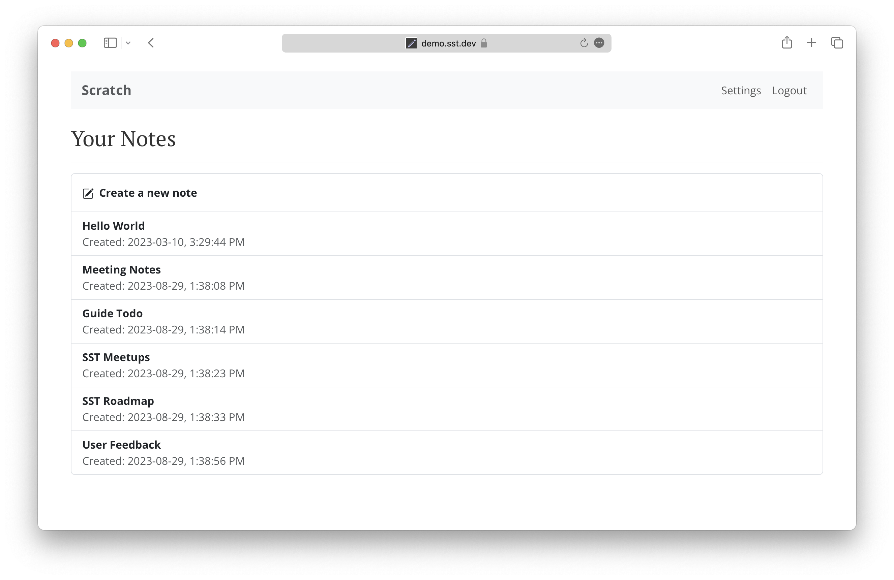

# SST Demo Notes App

The [SST Guide](https://sst.dev/guide) is a comprehensive open source tutorial for building and deploying full-stack apps using serverless and React on AWS.

We create a note taking app from scratch — [**demo.sst.dev**](https://demo.sst.dev)



We use React.js, AWS Lambda, API Gateway, and DynamoDB. This repo is a full-stack serverless app built with SST.

- The `infra/` directory defines our AWS infrastructure.
- The `packages/functions` directory contains the Lambda functions that power the CRUD API.
- The `packages/frontend` directory contains the React app.

It's a single-page React app powered by a serverless CRUD API. The app allows anyone to create, read, update, and delete notes without requiring authentication.

### Prerequisites

Before you get started:

1. [Configure your AWS credentials](https://docs.sst.dev/advanced/iam-credentials#loading-from-a-file)
2. [Install the SST CLI](https://ion.sst.dev/docs/reference/cli/)

### Usage

Clone this repo.

```bash
git clone https://github.com/sst/notes.git
```

Install dependencies.

```bash
npm install
```

#### Developing Locally

From your project root run:

```bash
npx sst dev
```

This will start your frontend and run your functions [Live](https://ion.sst.dev/docs/live/).

#### Deploying to Prod

Run this in the project root to deploy it to prod.

```bash
npx sst deploy --stage production
```

---

Join the SST community over on [Discord](https://discord.gg/sst) and follow us on [Twitter](https://twitter.com/SST_dev).
